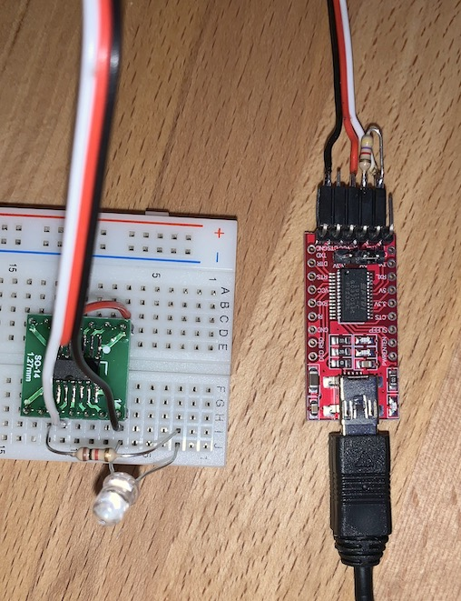

# Prerequisites
- install this avr-gcc toolchain
- install [pyupdi](https://github.com/mraardvark/pyupdi)
- get a USB-to-UART adapter, connect its RX and TX with a 4.7k resistor and connect RX with the RESET pin of the microcontroller. Connect 5V to the VCC pin and GND to the GND pin

# Compile and flash
In this example project directory, run `make flash`.
Sometimes, pyupdi hangs. In this case, ctrl-C and try again.